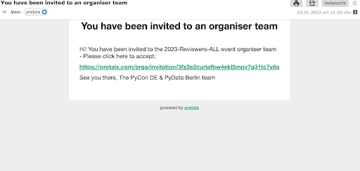
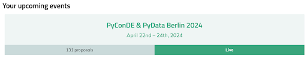
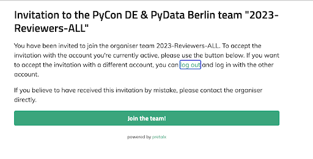
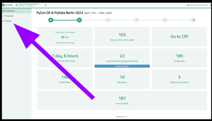
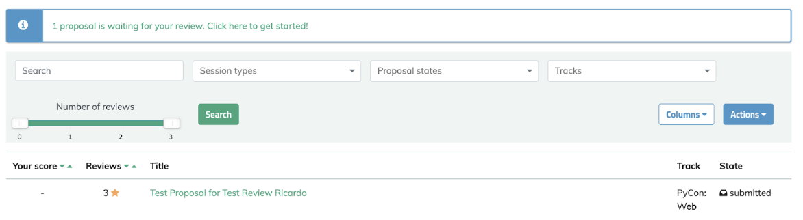
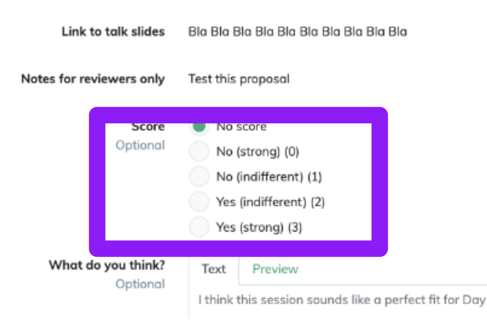
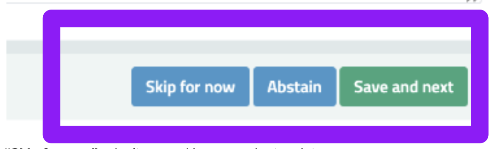
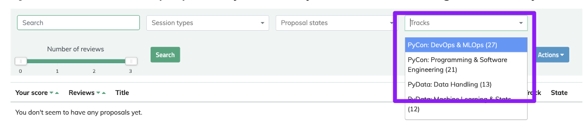

# Reviewer Guidelines: {{config.extra.event.event_name}}

!!! warning
    This document is a work in progress. Please check back later for updates.

!!! note
    ==This is an example for an event using Pretalx for the CfP, other tools may have other requirements.==

Use the online platform ==Pretalx== to review your assigned submissions by the end of day on
**{{config.extra.event.review_deadline}}**. If you have additional time and would like to review more submissions,
please contact the program helpdesk.

By reviewing submissions, you are helping the editors and the program committee make informed decisions on which talks
to accept or reject. The main criteria for evaluating each submission are the quality of the submission itself and how
important, novel, or interesting the proposed topic is. Your review should consider the talk proposal and its relevance
in the broader field. (See detailed criteria below.)

## Getting Started: Opening a Reviewer Account

Each reviewer should:

- Receive an invite to join the **reviewers team** via the helpdesk.
- Have an account on the Pretalx platform (either use an existing account or create a new one). Check your email (
  including spam/junk folders) for a Pretalx invitation in the last few days.
- Log in to the ==Pretalx== system and choose the event.
- Pick the "Review" option from the left menu bar.
- Start reviewing and check ==Pretalx== regularly as new proposals may be assigned to you.

Check out the Step-by-Step Pretalx Walkthrough below 🙂

### Timeline

Please review submissions by **{{config.extra.event.review_deadline}}**. The program committee will meet afterward to
make the final decisions on accepted and rejected submissions.

## Conference Scope

The conference scope is best explained in the Call for Proposals (CfP).

### Review Process

Proposals are assigned to you based on your preferences, as indicated in the registration form. If a submission already
has 3 or more reviews, there's no need to add another unless you have something particularly important to contribute.

Feel free to leave additional comments or concerns for the program committee when reviewing. You can review as many
submissions as you like.

## Review: Guidelines and Goals

The main criteria for evaluation include both the quality of the submission and the quality of the proposed talk. For
each submission, please consider these questions:

- Is this topic current?
- Is the topic relevant to our audience?
- How detailed is the submission? (Submissions with more details are easier to evaluate. A short, vague proposal is
  unlikely to reflect a well-thought-out talk.)
- How interesting do you expect the talk to be? (Remember, talks can be 30 or 45 minutes long, and tutorials are 90
  minutes. The proposed length will be listed in the submission.)

The CfP specifies that the following questions should be answerable after reading the submission:

- What problem is the talk addressing?
- Why is this problem relevant to the audience?
- What are the solutions to the problem, or is the talk simply highlighting an issue that should be known? (This can be
  useful too.)
- What are the main takeaways? (This is especially important for tutorial submissions. Clearly state what attendees will
  have learned by the end of the session.)

You can use these questions as guiding principles when evaluating submissions.

**Note:** We are looking for talks across different levels of expertise. The authors will indicate the expected level of
domain knowledge and familiarity with programming languages (e.g., Python) on the submission’s page. A beginner-level
talk may not be highly technical, but that doesn’t make it less valuable.

### After Considering a Submission

- **Conflict of Interest**:
  If you are the author of the submission or helped to write it, please click "Abstain" and avoid reading the reviews.
  This ensures everyone feels comfortable reviewing each other’s proposals.

- **Conflicts to Disclose**:
  If you continue to review, please disclose any conflicts of interest in your review (e.g., the author is from your
  workplace, a friend, or there’s personal bias on the topic/method).

- **Scoring System**:
  Give a score between 0 and 3 based on the following:

    - **Score 0 (No, Strong)**: You would argue against accepting the proposal.
    - **Score 1 (No, Indifferent)**: You don’t support the proposal, but wouldn’t argue against it.
    - **Score 2 (Yes, Indifferent)**: You support the proposal but wouldn’t argue strongly for it.
    - **Score 3 (Yes, Strong)**: You would argue strongly in favor of the proposal.

- **Comments**:
  Leave a comment justifying your score. Reviews should be detailed enough to help the program committee make an
  informed decision. Example comments could include:
    - "The topic is no longer relevant because of X."
    - "This is relevant because of Y."
    - "The proposal is interesting due to Z."

Please do not communicate directly with the author, even if you know them. All communication with authors will be
handled by the program committee.

### Submission Improvements

We encourage reviewers to avoid giving a strong rejection (score of 0) unless absolutely necessary. If you believe a
submission has potential but needs improvement, please leave constructive feedback. This helps the program committee
request revisions, and you may be asked to update your review if improvements are made.

### Additional Criteria for Evaluation

We encourage and discourage the following aspects in submissions:

#### Positive:

- Relevant to a broad audience.
- Discusses ethics.
- Uses open-source tools or methodologies.
- Focuses on practical methodologies rather than niche specifics.

#### Negative:

- The main aim is to sell a product or service.
- Uses closed-source software.
- The same talk has been given at other conferences (especially within similar circles).

## Practical Tips for Using ==Pretalx==

- If a proposal seems straightforward to you, feel free to score it and write your review.
- Use the search bar to find additional proposals on similar topics. Sometimes reviewing multiple proposals can help
  provide more context.
- Review in short sessions. Reviewing for extended periods can be tiring, so we recommend taking breaks using a
  pomodoro-like method.

Thank you for your time and contribution to making the review process effective and successful!

## ==Pretalx Walkthrough==

Step-by-step guide to using the Pretalx platform for reviewing submissions.

### Sign-up
1. Receive a one-time-use invite from us

**If you haven’t received an invitation or have trouble signing up, please contact helpdesk.**

2\. Click on the invite link.  
  (Note: the invite link only works once. If you want to get back to reviewing later, go to {{config.extra.event.cfp_link}})

3\. If you don’t have a pretalx account yet, set up your login credentials. 
   Otherwise, please use your existing account.

4\. Click on our event
 

5\. If you already have an account, you will see a different screen and click for the second time on **"Join the team"**.

### Reviewing
6\. Click on the Review tab

7\. You will see the proposals that have been assigned to you for review. 
    We took into account your preferences for the conference tracks (as indicated in the Reviewer sign-up form). 

8\. If you have reviews, then start reviewing them. If not, please wait for a day or two until you get assigned…

9\. Click on the proposal's title to start the review.

10\. On the review page, you will find the following fields:   

 - "**Title**" \- title of the proposed talk/tutorial  
 - "**Session Type**" \- proposed length of the talk   
 - "**Track**" \- track (selected by the author)  
 - "**Abstract**" \- short description  
 - "**Description**" \- core part of the proposal, detailed description of the suggested talk/tutorial  
 - "**Notes**"(optional) \- notes for conference organizers   
 - "**Expected audience expertise, Domain**" \- expertise in the domain (novice, intermediate, advanced)  
 - "**Expected audience expertise, Python**" \- level of experience with Python in general (novice, intermediate, advanced)  
 - "**Abstract as a tweet**" \- short description of the talk (for social media)  
 - "**Public link to supporting material**" (optional) \- links to publicly available sources (repositories, data sources etc.)  
 - "**Link to talk slides**" (optional) \- slides of the talk  
 - "**Notes for reviewers only**" (optional) \- notes from the author to reviewers  
 - "**Biography**" (optional) \- author’s biography

  At the bottom of the page, you will find radio-buttons for scoring, text field for comments, and 3 buttons on the lower right.

11\. Read the proposal. If you are its author or helped to write it, then click on the "Abstain" button in the lower
right.  
Otherwise, assign a score and **write a comment explaining it**. This is mandatory as we want to understand why you chose the score you chose.   
Example comments: "The topic is no longer current because X", "It is relevant because X", "The speaker is interesting because Y".  
See more in "More info on how to evaluate the submissions" section.  

12\. You can save your results with the buttons on the lower right. The buttons are:

**"Skip for now"** \- don’t save, skip now and return later

**"Abstain"** \- This button does not exist this year, just use "Skip for now" and don't score the proposal
if you want to abstain.

**"Save and next"** \- save and move to the next proposal. 

13\. **Tip:** You can search proposals using the search bar by any word. It helps to evaluate similar proposals at once.

14\. **Tip**: You can filter the proposal by Track, if you have been assigned to many tracks. 

The dropdown shows all the conference tracks, like **PyData: Data Handling (13)**.
The number (13) is the total proposal counter in the track \- it can be smaller than the number of proposals
that are assigned to you to review and it is ok. We don’t assign everything to one reviewer.

15\. **Tip**: you can also filter proposals by the number of reviews to select proposals that have not been 
reviewed yet or have been reviewed only once. See the slider "Number of reviews" in the filter section. 

## Social Media

We hope you are excited about the submissions and the reviews, because we are. If you would like to share your 
excitement and your experience being a reviewer for the PyData / PyConDE on social media 
(LinkedIn, Facebook, Twitter etc.) then we would appreciate it. 
Please refrain from sharing any specifics about the speakers and their submissions.

## FAQ

1. **Q:** I clicked on the invite link and get Error 404  
   **A:** No worries, you are probably already signed up! Try going to {{config.extra.event.cfp_link}} (The invite link only works *once*.)

---
