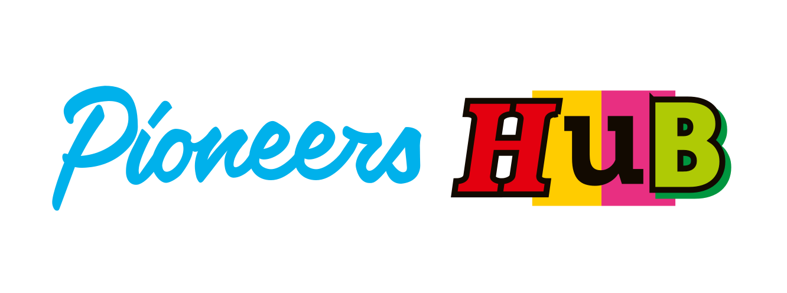

# :fontawesome-solid-book-atlas: Your Guide to Organizing an Amazing Community Conference

## What's This All About?

Welcome to the world of community-driven conferences! If you're new here, don't worry – this guide is for you. We've
created this playbook to help anyone, regardless of experience, understand how to organize a conference that's powered
by volunteers and fueled by passion.

## Why a Playbook?

Organizing a conference might sound intimidating, but it doesn't have to be! This playbook breaks down the process into
manageable steps. It's based on years of experience from events like PyCon DE, EuroPython, EuroSciPy, and PyData Berlin.
We're sharing our knowledge so you can create an amazing event without reinventing the wheel.

## What's Inside?

1. **Getting Started**: Everything you need to kick off your conference planning
2. **Our Mission**: Understanding the heart of a community-driven conference
3. **Building Your Team**: How to gather and organize your volunteer squad
4. **Calling All Helpers**: Tips for attracting and engaging volunteers
5. **Ground Rules**: Creating a positive environment for everyone
6. **Behind the Scenes**: Setting up the operational backbone of your conference
7. **Words of Wisdom**: Key principles for smooth organizing

## How to Use This Guide

Whether you're a first-time organizer or a seasoned pro, this playbook is designed to help you at every stage. Feel free
to jump to the sections most relevant to you, or read through from start to finish for a comprehensive overview.

## Let's Get Started!

Ready to dive in? Check out our [Getting Started Guide](installation.md) to take your first steps in conference
organizing.

## A Big Thank You

It is based on the experience of running and co-organizing events like [PyCon DE](https://de.pycon.org/),
[EuroPython](https://europython.eu), [EuroSciPy](https://euroscipy.org) and [PyData Berlin](https://berlin.pydata.org).

This playbook wouldn't exist without the hard work and dedication of countless volunteers who've organized conferences
over the years. Their experiences and insights have been invaluable in creating this resource.

❤️ We're grateful to everyone who has contributed to making these events better year after year.

## Attribution

This plyabook draws on years of experience from organizing of running and co-organizing events since like
[PyCon DE](https://de.pycon.org/)
and [PyData Berlin](https://berlin.pydata.org), [EuroPython](https://europython.eu), [EuroSciPy](https://euroscipy.org)

These awesome people have contributed to content this documentation was built upon:

[Aeneas Christodoulou](https://github.com/AeneasChristodoulou): Video;
[Alexander CS Hendorf](https://github.com/alanderex): Program, Steering, Office;
[Alina Lenhardt](https://github.com/alina-lenhardt): Program, Communication;
[Anastasia](https://github.com/asamokhina): Communication;
[Anja Pilz](https://github.com/aplz): Program;
[Christopher Schultz](#): Program;
[Daniel Ringler](https://github.com/dringler): Infrastructure, Steering;
[Florian Wilhelm](https://github.com/florianwilhelm): Program;
[Julio Batista Silva](https://github.com/jbsilva): Diversity;
[Jurik Sommer](https://github.com/Jurik-001): Program;
[Kristian Rother](https://github.com/krother): On-Site;
[Lisa Andreevna Chalaguine](#): Program;
[Marisa Mohr](https://github.com/marisamohr): Program;
[Maryam Pourranjbar Mohr](#): Program;
[Matthias Hofmann](#): Program;
[Mihail Douhaniaris](https://github.com/mtdo): Video;
[Mojdeh Rastgoo](https://github.com/mrastgoo): Diversity;
[Naa Ashiorkor Nortey](https://github.com/7ashiorkor7): Diversity;
[Nils Finke](https://github.com/FinkeNils): Program;
[Nydia Medina](https://github.com/nydiamedina): Diversity;
[Olakunle Olaniyi](https://github.com/rugging24): Communication;
[Paula González Avalos](https://github.com/pga99): Diversity;
[Ricardo Kawase](#): Program;
[Sabine Reisser](https://github.com/orgs/PYCONDE/people/sreisser): Video;
[Sebastian Neubauer Reisser](https://github.com/sebastianneubauer): Video, Steering;
[Shivam Singhal](https://github.com/championshuttler): On-Site;
[Theodore Meynard](https://github.com/orgs/PYCONDE/people/terezaif): Diversity, Swag;
[Valentina Scipione](https://github.com/astrovale): On-Site;

We missed mentioning you?   
We value all contributions to this project, including those made in the past. If you have contributed to
community-driven conferences or this playbook in the past and would like to be acknowledged:

1. Open a pull request titled "Add [Your Name] to Contributors".
2. In the pull request description, briefly describe your contribution. For example:
    - "I helped organize 2022 in program"
    - "I contributed the section on volunteer management of this playbook"

We'll review your pull request and merge it if appropriate.

## Who We Are

This playbook is maintained by [Pioneers Hub](https://www.pioneershub.org/en/), an organization dedicated to building
and nurturing communities of experts in tech and research. Our goal is to facilitate knowledge sharing, collaboration,
and innovation.

{ style="width:50%" }

Together, let's create conferences that inspire, educate, and bring people together!